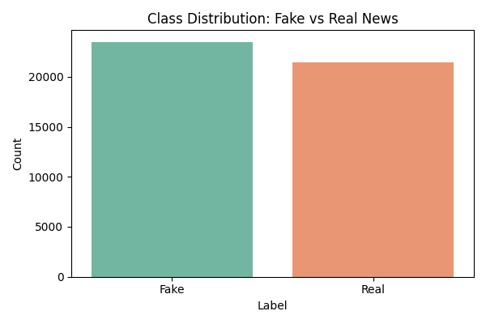
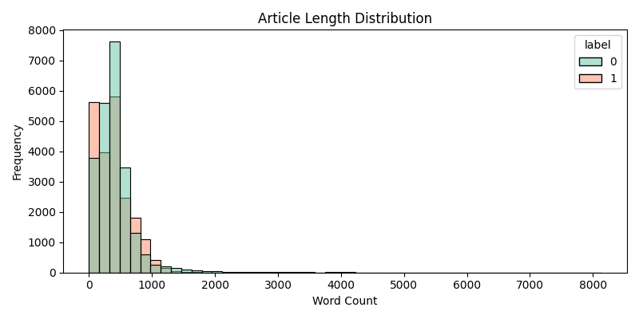
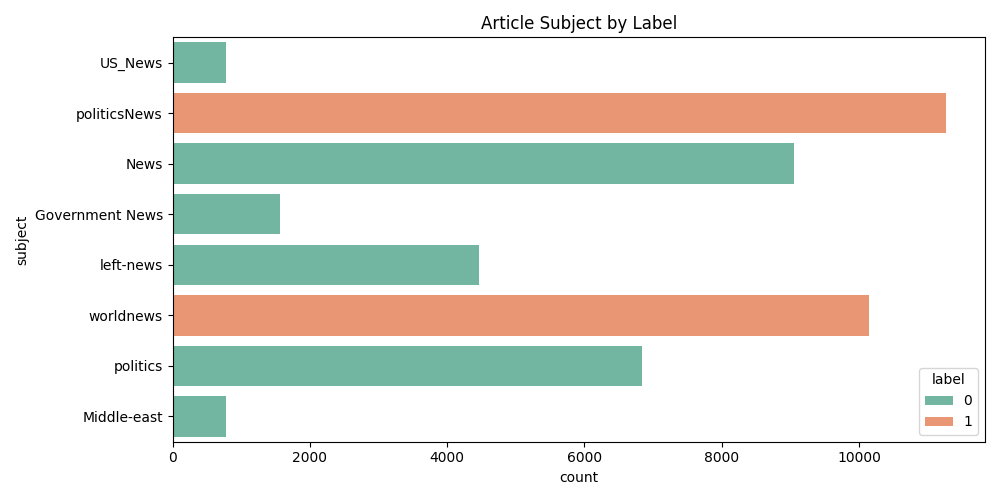
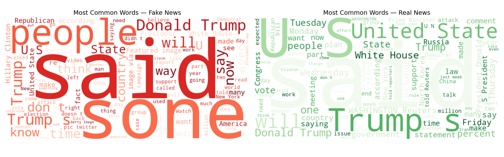
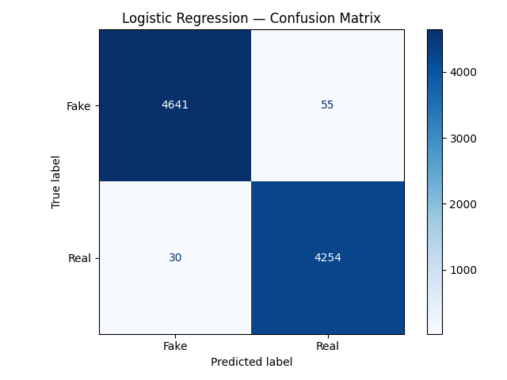
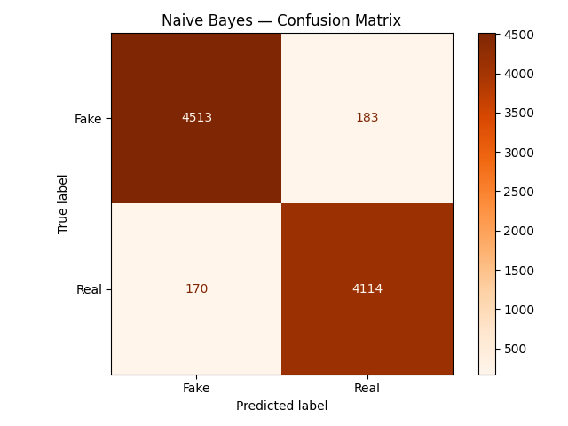
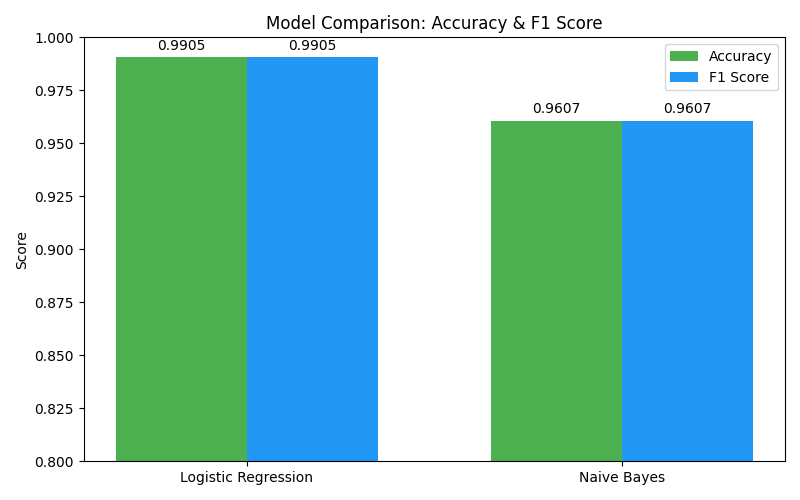
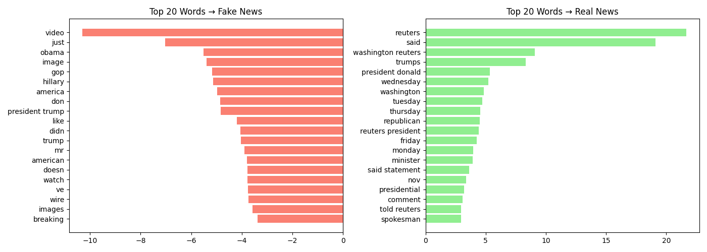

# Fake News Detection Using Natural Language Processing

A machine learning project that classifies news articles as **Fake** or **Real** using Natural Language Processing (NLP). This project compares two supervised machine learning algorithms—**Logistic Regression** and **Multinomial Naive Bayes**—using TF-IDF vectorization for feature extraction.

---

## Project Overview

The objective of this project is to build an NLP-based classifier capable of distinguishing fake news from real news articles.

The project includes:

- Data loading and preprocessing
- Exploratory Data Analysis (EDA)
- Feature engineering
- TF-IDF vectorization
- Logistic Regression
- Multinomial Naive Bayes
- Model evaluation
- Data visualization

---

## Dataset

This project uses the **Fake and Real News Dataset** containing two CSV files:

- **Fake.csv** – Fake news articles
- **True.csv** – Real news articles
---

## Technologies Used

- Python
- Pandas
- NumPy
- Scikit-learn
- Matplotlib
- Seaborn
- WordCloud

---

## Project Files

```
fake-news-detection-nlp/
│
├── Fake.csv
├── True.csv
├── fake_news.py
├── README.md
│
├── article_length.png
├── class_distribution.png
├── subject_breakdown.png
├── wordclouds.png
├── cm_logistic.png
├── cm_naive_bayes.png
├── model_comparison.png
└── top_words.png
```

---

## Machine Learning Workflow

1. Load Fake and True news datasets
2. Assign labels (Fake = 0, Real = 1)
3. Merge datasets
4. Perform exploratory data analysis
5. Clean and preprocess text
6. Combine article title and content
7. Convert text into TF-IDF vectors
8. Split data into training and testing sets
9. Train machine learning models
10. Evaluate model performance
11. Visualize results

---

## Models Used

### Logistic Regression

- TF-IDF Vectorization
- Accuracy: **99.05%**
- Weighted F1 Score: **99.05%**

### Multinomial Naive Bayes

- TF-IDF Vectorization
- Accuracy: **96.07%**
- Weighted F1 Score: **96.07%**

---

## Visualizations

### Class Distribution



---

### Article Length Distribution



---

### Subject Distribution



---

### Word Clouds



---

### Logistic Regression Confusion Matrix



---

### Naive Bayes Confusion Matrix



---

### Model Comparison



---

### Top Predictive Words



---

## Performance Summary

| Model | Accuracy | Weighted F1 Score |
|--------|----------|-------------------|
| Logistic Regression | **99.05%** | **99.05%** |
| Multinomial Naive Bayes | **96.07%** | **96.07%** |

Logistic Regression achieved the highest performance, correctly classifying fake and real news articles with approximately **99% accuracy**.

---

## How to Run

### Clone the repository

```bash
git clone https://github.com/amanxshahhhh/fake-news-detection-nlp.git
```

### Navigate to the project

```bash
cd fake-news-detection-nlp
```

### Install dependencies

```bash
pip install -r requirements.txt
```

### Run the project

```bash
python fake_news.py
```

The script will generate:

- Class distribution chart
- Article length distribution
- Subject breakdown
- Word clouds
- Confusion matrices
- Model comparison chart
- Top predictive words visualization

---

## Future Improvements

- Implement Support Vector Machine (SVM)
- Fine-tune hyperparameters
- Experiment with deep learning models (LSTM, BERT)
- Deploy the model as a web application using Streamlit or Flask
- Add real-time news prediction functionality

---

## Author

**Amanullah Shah**

GitHub: https://github.com/amanxshahhhh

---

## License

This project is intended for educational and portfolio purposes.
